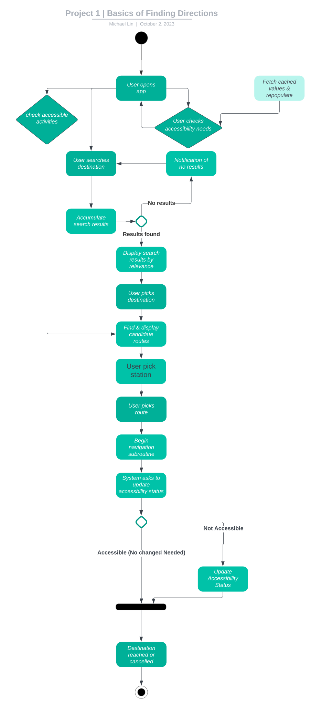

# Specification Phase Exercise

A little exercise to get started with the specification phase of the software development lifecycle. See the [instructions](instructions.md) for more detail.

## Team members

[Erick Cho](https://github.com/ec3566)  
[Michael Lin](https://github.com/freerainboxbox)  
[Ahmed Omar](https://github.com/ahmed-o-324)  
[Henry Wang](https://github.com/fishlesswater)  

## Stakeholders

### Stakeholder: Jae Yoon 
##### Goals:  
1. To get where they need to go with consideration for their handicap.
2. Find out how accessible the location they wanted to visit was.
3. Route planner that takes into account their specific handicap.
##### Concerns:
1. Accuracy of the accessibility information.
2. State of the amenities.

## Product Vision Statement

A crowdsourced accessibility focused navigation app where users can tailor routes to accomodate for their specific needs and collectively update a location's accessibility information.

## User Requirements

### As a user, I want to filter for restaurants that are wheelchair accessible so I can go out with my friends.
Estimation of effort: L  
Acceptance criteria:
1. User's accessibility needs are available to be selected.
2. User's accessibility profile is saved.
3. User's accessibility profile is private.
4. All restaurants that are wheelchair accessible are displayed.

### As a user, I want to plot a route for the visually impaired so I can more easily make my way to my destination.
Estimation of effort: M  
Acceptance criteria:
1. User's starting point is captured and saved.
2. User's destination is captured and saved.
3. A route using public transportation with amenities for the visually impaired is displayed.
4. If a complete route cannot be made, sections without amenities are indicated.

### As a user, I want to update a location's accessibility information so I can contribute to the app (this one needs better wording)
Estimation of effort: L  
Acceptance criteria:
1. An "update location amenities" button is visible.
2. A menu pops up when the button is pressed.
3. Users can select and deselect amenities.
4. Information is saved to the server.
5. If enough changes are indicated by users, the location's information is updated for all users of the app (with a confidence score).

### As a business, I want to update my location's accessibility information so I can attract more people to my place of business.
Estimation of effort: L  
Acceptance criteria:
1. Proof of ownership must be captured.
2. Ownership must be verified.
3. Business is now prompted to adjust and change its accessibility information as they please.
4. Information is uploaded to the server and weighted more than anonymous users.

### As a user, I want to share a location's accessibility availability to my friends and family so I can help them get somewhere.
Estimation of effort: L  
Acceptance criteria:  
1. Location's accessibility information is displayed for the user.
2. User clicks a share button.
3. A menu pops up with links to relevant social media platforms where the user can share the information.
4. A premade message listing the accessibility information of the location is sent through the social media of choice.

### As a user, I want to be guided through a route so I can get to where I need to go.
Estimation of effort: L  
Acceptance criteria:
1. User's starting point is captured and saved.
2. User's destination is captured and saved.
3. Server checks user's accessibility preferences.
4. A route is generated for the user.
5. User clicks "Start Route".
6. User is guided through the route, with voice if indiciated that it is necessary.
7. User reaches their destination and a pop up asking about the accuracy of the accessibility information is raised.
8. User answer is captured and saved, and any errors noted.

### As a beta tester, I want to be able to conveniently report usage issues, errors, and miscellaneous feedback to the developers.
Estimation of effort: M  
Acceptance criteria:
1. Beta builds should automatically include screens for reporting functionality. This should be incorporated into the build workflow.
2. Users must be presented with a disclaimer regarding anonymous system information reporting (e.g. OS, build number, hardware).
3. The main reporting interface should present a dropdown menu to allow for quick categorization of issues.
4. Beta testers should be able to provide details and screenshots after selecting a category.
5. An internal issue tracker should automatically be updated with beta issue tickets, including all gathered telemetry info.

### As a user with cognitive impairment, I want to receive notifications about service disruptions on my planned route so that I can adjust my travel plans accordingly.
Estimation of effort: L  
Acceptance criteria:
1. Users with cognitive impairments can set preferences for receiving notifications about service disruptions.
2. If a disruption occurs on the planned route, clear and simple notifications are sent to aid users in adjusting travel plans.
3. The notifications include information about the disruption and suggest alternative routes if available.
4. When the services are restored, user should be notified again.

### As a user with limited vision and hearing, I want the app to consider elevators and escalators' status in train stations so that I can navigate with confidence.
Estimation of effort: L  
Acceptance criteria:
1. Users with limited vision and hearing can filter routes based on the status of elevators and escalators for added confidence in their navigation.
2. Elevator and escalator information is presented with clear and contrasting visuals for users with limited vision.
3. If an elevator or escalator is out of order, the app suggests alternative accessible routes and provides clear audio notifications for users with limited hearing.
4. Users can easily report the status of elevators and escalators to contribute to real-time updates, improving experiences from others.

### As a user who moves with a wheelchair and prefers to know about accessible entrances, I want to receive specific details about entrances with ramps or elevators near my destination so that I can plan my journey effectively.

Estimation of effort: M  
Acceptance criteria:
1. Users who move with a wheelchair can input mobility preferences, indicating the need for information about accessible entrances with ramps or elevators.
2. The app considers the user's accessibility profile, providing detailed information about entrances with ramps or elevators which is specified to each possible entrance of subway.
3. This information should be easily accessible by any means.

## Activity Diagrams

As a user, I want to plot a route for the visually impaired so I can more easily make my way to my destination.  

As a user, I want to update a location's accessibility information so I can contribute to the app.  

## Clickable Prototype

https://www.figma.com/file/xHPudwTWogFcHleOjrzoAN/Project_%231_Clickable?type=design&node-id=1%3A2&mode=design&t=Fmmv1Fzs8vp2x7t8-1

